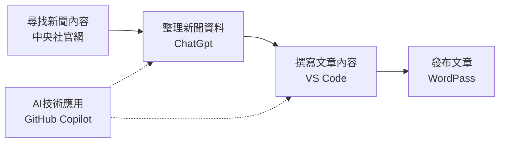

# A113010143 謝承霖

## 一、我為什麼選這個?

近年來，青年政治參與議題受到社會各界重視。年輕世代不僅是未來社會發展的重要力量，其投票行為與公共參與程度也會影響民主制度的發展。然而，部分調查顯示青年投票意願有下降趨勢，因此提升青年對公共事務的關心已成為重要課題。

本專題選擇「青年投票率下降引關注　專家呼籲提升政治參與」作為新聞主題，希望透過 AI 技術將複雜的政治與社會議題轉換成易於理解的新聞摘要與資訊圖表，幫助讀者快速掌握重點資訊。同時，也藉由本主題展示 AI 在新聞內容分析、資訊整理與視覺化呈現上的應用價值，提升資訊傳播效率與閱讀體驗。

相關新聞來源：https://cocorico.info/a113010143/2026/06/08/%e9%9d%92%e5%b9%b4%e6%8a%95%e7%a5%a8%e7%8e%87%e4%b8%8b%e9%99%8d%e5%bc%95%e9%97%9c%e6%b3%a8%e3%80%80%e5%b0%88%e5%ae%b6%e5%91%bc%e7%b1%b2%e6%8f%90%e5%8d%87%e6%94%bf%e6%b2%bb%e5%8f%83%e8%88%87/

## 二、使用的工具

| 工具 | 用途 |
| --- | --- |
| VS Code | 編輯與管理專案文件 |
| GitHub Copilot | 協助編輯 README 內容 |
| ChatGpt | 整理新聞資料、內容 |
| WordPass | 發布文章 |
| 中央社官網 | 尋找相關新聞內容 |

##  三、工作流程圖

## 四、每個步驟做了什麼

1. 選題
   - 確定新聞報導主題，選擇具社會意義且讀者關心的議題。
   - 評估題材的新聞價值、資料來源是否充足，並決定報導角度。

2. 事實整理
   - 收集相關報導、官方資料、專家意見與背景資訊。
   - 將資訊分類整理，確認重點事實與時間順序，避免錯誤訊息。

3. 撰寫報導
   - 依照新聞結構撰寫內容，包括導語、背景、細節與結論。
   - 補上引用來源與必要數據，保持語句清楚、客觀中立。

4. 發布文章
   - 校對全文、檢查標題與排版，確認無錯字或事實錯誤。
   - 上傳至平台發布，必要時同步分享或發布通稿。

## 五、遇到的困難

1.
- 發布文章時遇到平台操作流程不熟悉，造成上稿速度變慢。
- 需要確認排版、標題與附圖是否符合格式，增加發布前的校對工作。

2.
- GitHub 上傳時可能遇到版本衝突、分支管理或推送失敗等問題，導致專案更新無法順利同步。

## 六、成果
- 報導的文章發在WordPass

- 資料來源公開且完整

- 報導的文章發在WordPass

- 資料來源公開且完整
